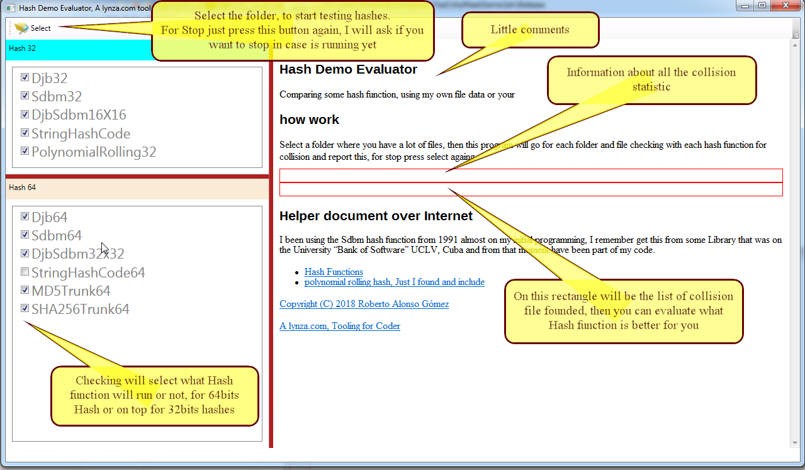

## Hash Demo Evaluator

Comparing some hash function, using my own file data or your

### how work

Select a folder where you have a lot of files, then this program will go for each folder and file checking with each hash function for collision and report this

#### Helper document over Internet
I been using the __Sdbm__ hash function from 1991 almost on my initial programming, I remember get this from some Library that was on the University “Bank of Software” UCLV, Cuba and from that moment have been part of my code.

 1. [Hash Functions](http://www.cse.yorku.ca/~oz/hash.html)
 2. [Polynomial rolling hash, Just I found and include](https://cp-algorithms.com/string/string-hashing.html)

[Download release](https://github.com/rag70/WpfHashDemo/blob/master/bin/Release/WpfHashDemo.exe)

[Copyright (C) 2018 Roberto Alonso Gómez](http://lynza.com)

[lynza.com: A tooling for Coder](http://lynza.com)